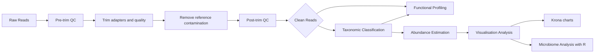

# README
<!-- toc -->
- [AuOF](#auof)
	- [Overview](#overview)
	- [Installation](#installation)
		- [Beware](#beware)
		- [Package](#package)
		- 
<!-- tocstop -->
# AuOF
## Overview
A pipeline to carry out processing and analysis of metagenomic whole genome sequences as part of the Antibiotics under our feet project. While the pipeline is able to automate a majority of the process, downstream analyses still requires further manual intervention. Additionally user input is required to configure the running the pipeline. The pipeline is primarily written in python3 with the running script written in Bash/Shell. The pipeline takes in paired-end Illumina short read sequences from a metagenomic source. It has been extensively tested and developed using Illumina short read sequences from metagenomic soil samples.
### Pipeline

## Installation
### Beware
- The pipeline was developed using the full NCBI RefSeq database for taxonomic profiling. This means ~130GB of storage is required for a similar set up.
- Due to the large size of the database used for the taxonomic profiling, the pipeline was tested with 150GB of RAM because the database is loaded into memory for the profiling step
- It is not necessary to use the full RefSeq database for taxonomic profiling however, it IS necessary that the amount of memory used for the pipeline is able to hold your database in memory with overhead to allow other processes to occur at the same time. 
### Package
- The forked KrakenTools package from https://github.com/damioresegun/KrakenTools
- To install:
	- **wget**
		```bash
		# download
		wget https://github.com/damioresegun/KrakenTools/archive/refs/heads/master.zip
		# unzip
		unzip master.zip
		```
	- **git**
		```
		git clone git@github.com:damioresegun/KrakenTools.git
		```
### CONDA/MAMBA

The rest of the tools are easily installed using conda. If you have mamba, it is recommended to use mamba as it is quicker to install.

#### Install MAMBA
`conda install mamba -n base -c conda-forge`

#### Install packages
##### Tools and Versions
| Tools          | Version |
| -------------- | ------- |
| BMTAGGER       | 3.101   |
| Assembly-stats | 1.0.1   |
| Bracken        | 2.6.2   |
| Cutadapt       | 1.18    |
| FastQC         | 0.11.9  |
| Humann         | 3.1.1   |
| Kraken2        | 2.1.2   |
| Kraken-biom    | 1.0.1   |
| Krona          | 2.8.1   |
| Metaphlan      | 3.0     |
| Pigz           | 2.6     |
| Pip            | 22.1.1  |
| Python         | 3.7.12  |
| R              | 4.1     |
| R-base         | 4.1.3   |
| Samtools       | 0.1.19  |
| Trim-galore    | 0.6.7   |
#### Easy Install
For an easier and somewhat quicker way to get the environment going, you can use the YAML file that is within this package to create a similar environment to which this pipeline was developed on. 

????

### Additional Downloads
#### Modified Krakentools
This is a modified forked version of Krakentools that was expanded to allow for the generation of reports that are compatible with metaphlan3. **Note:** Krakentools' `kreport2mpa.py` converts the Kraken2 report into a metaphlan-style report however, the generated output is a metaphlan version 2 output. However for this pipeline, metaphlan version 3 is needed; instigating the expansion of the `kreport2mpa.py` to become `kreport2mpa3.py` in this package.
```shell
# modified krakentools
wget https://github.com/damioresegun/KrakenTools/archive/refs/heads/master.zip
unzip master.zip
# the path to the unzipped folder will be needed for the master script!
```
### Install databases
#### Kraken
- Below is a guide to download and install the full RefSeq nucleotide database for Kraken taxonomic classification
```bash
# make the folder
mkdir Kraken_DB
# download the taxonomy files
kraken-build --download-taxonomy --db Kraken_DB --threads 12
# download the libraries you want for your database
# bacteria
kraken2-build --download-library bacteria --db Kraken_DB --threads 12 --no-masking
# viruses
kraken2-build --download-library viral --db Kraken_DB --threads 12 --no-masking 
# protozoa
kraken2-build --download-library protozoa --db Kraken_DB --threads 12 --no-masking 
# fungi
kraken2-build --download-library fungi --db Kraken_DB --threads 12 --no-masking 
# archaea
kraken2-build --download-library archaea --db Kraken_DB --threads 12 --no-masking 
# plant
kraken2-build --download-library plant --db Kraken_DB --threads 12 --no-masking 
# plasmids
kraken2-build --download-library plasmids --db Kraken_DB --threads 12 --no-masking
```
- In some instances, an error might occur during the installation of the database after running the `kraken2-build` command:
	```bash
		ERROR: "rsync_from_ncbi.pl: unexpected FTP path (new server?) for https://ftp.ncbi.nlm.nih.gov/genomes/all/GCF/900/128/725/GCF_900128725.1_BCifornacula_v1.0"
	```
	- This can be solved by opening the `rsync_from_ncbi.pl` script that is installed along with kraken2 and change line below:
	```perl
		# original line
		if (! ($full_path =~ s#^ftp://${qm_server}${qm_server_path}/##)) { 
		# changed to:
		if (! ($full_path =~ s#^https://${qm_server}${qm_server_path}/##)) {
	```
- Other errors that can come up during installation is: `rsync_from_ncbi.pl: unexpected FTP path (new server?) for na`
	- To fix this, the `assembly_summary.txt` that is created from the `kraken2-build` command has to be fixed. This means:
	``` bash
		# change into the library affected. Here it is in the bacteria
		# there should be a file named: assembly_summary.txt
		awk -v FS='\t' '$20 != "na" {print $0}' assembly_summary.txt > new_assembly_summary.txt 
		cp new_assembly_summary.txt assembly_summary.txt
	```
#### Bracken
Once bracken is installed with conda and the kraken database has been downloaded as described above, the bracken index can be built with:
```bash
bracken-build -d Kraken_DB/ -t 24 -k 35 -l 100
# -t is the number of threads used
# -k is the kmer length to use in the re-estimation process of bracken
# -l minimum sequence length in your sequences
```
#### HUMAnN
Finally, the HUMAnN database has to be built using metaphlan and chocophlan databases. For this the recommended databases would be the `chocophlan` and `uniref90` databases. There is also the `uniref50` database to download However, for more options, see the HUMAnN manual: https://github.com/biobakery/humann/blob/master/readme.md
```shell
# remember to first activate the conda environment with the rest of the installed packages
# install the chocophlan database
humann_databases --download chocophlan full HUMANN_DB/
# install the uniref90 database
humann_databases --download uniref uniref90_diamond HUMANN_DB/
```
## Pipeline Options
### Required Parameters
- `-i /--input`: The path to the directory holding the demultiplexed FASTQ files. FASTQ files can be gzipped or left uncompressed. **Note:** The FASTQ files have to be named with _1 and _2
- `-o /--output`: Full path to the directory to save analysis outputs. This folder should either be empty or not created yet. The pipeline will check if the folder is already created -- if so, the pipeline will continue only IF the folder is empty
- `-r /--reference`: Full path to the reference genome to use for decontamination. In theory, this can be any other reference genome and the script can be tweaked to accept more than one reference genome for decontamination. In testing, the human reference genome *hg19* was used.
- `-kr /--kraken`: Full path to your kraken installation if it is not in the $PATH. If in your $PATH, simply write `-kr kraken2`
- `-br /--bracken`: Full path to your bracken installation if it is not in the $PATH. If in your $PATH, simply write `-br bracken`
- `-kb /--kraken_DB`: Full path to the kraken database you have built
- `-kt /--kraken_tools`: Full path to the KrakenTools package forked by DRO
### Optional Parameters
- `-t /--threads`: Number of threads. Default is `24`
- `-m /--max-memory`:  Maximum available memory to use in megabytes e.g. for `100G` of memory, enter `100000`. Default is `24000` i.e. `24G`
- `-kt /--kraken_hit_threshold`: A minimum number of groups that must be matched to place a contig into a taxonomic group. Default is `5`
- `-bt /--bracken_hit_threshold`: A minimum number of *k-mers* that must be matched to place a contig into a taxonomic group by bracken re-estimation. Default is `20`
- `-bl /--bracken_read_length`: The read length used to build your bracken database. **Note:** Your bracken database is also the kraken database. Default length is `100`
- `-f /--functional`: Full path to the humann v3+ package if not in $PATH. If in $PATH, this parameter is not necessary. Default is `humann`

## Pipeline Running Script
To make configuration easier, the `config.sh` file was added to allow the user to easily enter the different parameters to run the main python script. The `config.sh` script is written in Bash/Shell with different variables for the user to populate according to their use-case. Once entered, the user can simply call the config script with `sh config.sh` or `./config.sh` to run the analysis pipeline. The variables entered by the user in the `config.sh` correspond to the parameters of the `AuOF_MasterControlScript.py`
### Variables
- `AuOF`: Enter the path to the AuOF_MasterControl python script. Example: `AuOF=/path/to/my/AuOF_microbiome/AuOF_MasterControl.py`
- `input`: Enter the path to the folder holding the directories of the reads. Example: `input=/path/to/my/folder/holding/multiple/demultiplexed/read/folders`
- `output`: Full path to the output folder. Example: `output=/path/to/my/output/folder/for/all/isolates`
- `reference`: Path to the reference genome for decontamination. Example: `reference=/path/to/my/hg38.fa`
- `kraken`: Path to the kraken2 package. If in the $PATH then just enter `kraken2`. Example: `kraken="kraken2"` or `kraken=/path/to/my/Kraken2/folder/kraken2`
- `bracken`: Path to the bracken package. If in the $PATH then just enter `bracken`. Example: `bracken="bracken"` or `bracken=/path/to/my/Bracken/folder/bracken`
- `krakenDB`: Path to the kraken2 database. Example:`krakenDB=/path/to/my/Kraken_DB/folder`
- `threads`: Number of threads. Example: `threads=24`
- `memory`: Enter the maximum memory to use in megabytes. Example: `memory=150000`
- `krakenTool`: Path to the krakentools package directory. Must have the `kreport2mpa3.py` script. Example: `krakenTool=/path/to/my/KrakenTools/folder`
- `krakThres`: State the kraken hit threshold. Example: `krakThres=5`
- `brakThres`: State the bracken hit threshold. Example: `brakThres=20`
- `brakRead`: State the bracken read length. Example: `brakRead=100`
- `humann3`: Full path to the humann package or if in $PATH enter `humann`. Example: `humann3="humann"` or `humann3=/path/to/my/HUMAnN/folder/humann`

### Pipeline Breakdown
#### QC and Filtering
- Initial quality checks are done using FastQC before adapter and quality trimming occurs with trim-galore
- **FastQC:** called using the `fastqc` function in the `Tools.py` script. Requires a `pre` or `post` description to determine if the input data is pre or post contamination removal
- **Trim-galore:** called using the `trimmy` function in the `Tools.py` script. Runs trim-galore on the forward and reverse reads. Outputs trimmed forward and reverse reads in the stated output folder
- **Remove reference contamination:** While these are soil samples, there will be human sequences in the samples to remove. This is done using BMTAGGER with the `bmtagAligner` function in the `Tools.py` script
#### Taxonomic Classification
- Clean reads are taxonomically classified using Kraken2 and then the abundance reestimation occurs using bracken. 
- **Kraken2** and **Bracken** are called using the `krakbracken` in the `Tools.py` script. See the function to see the usage and parameters used.
- The outputs after bracken are important for functional analysis and the visualisation downstream
#### Functional Profiling
- The bracken output reports are converted to a metaphlan format using krakentools `kreport2mpa3.py`
- The conversion occurs within the `krakbracken` function workflow
- The generated metaphlan-style taxonomic information is used as input for the `humann3` function in the `Tools.py` for functional profiling 
- Outputs three tables detailing the functional gene families, functional pathway abundance and coverages
#### Visualisation Analyses
- **Krona** The bracken output reports are converted to Krona charts in the form of `.html` files. These files can be opened in a browser to view, investigate and analyse
- **Microbiome community analysis**: The bracken outputs are also combined and converted into `.biom` files which can be used to investigate microbiome composition using R. 
	- Using a **GUI** like **Rstudio**, the **MicrobiomeAnalysis_GUI.R** can be used to investigate community composition, abundance and diversity
	- To run, the script requires:
		- full path to the **biom file**
		- full path to the **output folder** (this has to already exist!)
		- full path to the **sample metadata**
		- **png** or **tiff** for image format
	- Plots and tables are generated in the output folder
	- Open the R script file for more information
	- **NOTE: There is a command line version of this script: "MicrobiomeAnalysis_cml.R". However, this is not recommended for use. In testing, it is often temperamental and requires some fixes.**

## Outputs
Outputs are generated for each isolate with a folder made for each folder and the results of each analysis step are placed in associated folders. For each major step, the folders to be generated and their contents are described below.
### QC and Filtering
#### PreQC_FastQC
- Contains the outputs of the first quality checks on the raw demultiplexed data
- Recommended to open the `.html` files and view the outputs on a browser
#### BMTAG
- Contains the list of reads identified to be contaminated with the input reference genome provided by the user. In testing, the human genome was used as reference
- *You do not need to open this file and can be deleted if space is required*
#### TrimmedReads
- Contains the outputs of `trim-galore`. 4 files are created however the `_R*_trimmed` are copies that will be used by the pipelines downstream
#### CleanReads
- Contains the reads after removing the reference contamination (`_R*_clean_reads`)
- For the HUMAnN functional profiling step, the clean reads have to be combined into a single file, this results in the file saved as `_combinedReads`
#### PostQC_FastQC
- Similar outputs to the `PreQC` however, contains the outputs of quality check on reads after trimming and reference contamination removal
### Taxonomic Classification
#### Kraken
- Contains the outputs of the taxonomic classification by Kraken2 **only**
- `All_classification.tsv` - contains a full classification information however this is not human readable. This classification is used to generate the report file
- `_fullreport.txt` - is the human-readable report file for the taxonomic classifications given to the isolate. See more information, see: https://github.com/DerrickWood/kraken2/blob/master/docs/MANUAL.markdown#sample-report-output-format
- `_classified_*.fastq` - are the reads which have been successfully classified by Kraken2. Each read will contain the identified taxid in the readID
- `_unclassified_*.fastq` - are the reads which were not classified with kraken2
#### Bracken
- Contains the outputs from the bracken re-estimation of the krona taxonomic assignments
- Also contains the converted krona files for visualisation. See the visualisation step below
- `bracken_classicreport.txt` - is the abundance re-estimation of the kraken2 outputs. It is saved in a similar format to the original kraken2 `fullreport.txt`. This file will be converted to biom files and metaphlan downstream
- `bracken_fullreport.txt` - contains the un-interpreted re-estimation values for the classified reads. Shows:
	- the taxid
	- the number of reads kraken assigns to the taxid
	- the number of reads that has been added to the taxid **after** bracken re-estimation
	- the new estimated number of reads assigned to the taxid
	- the fraction of total reads i.e. relative abundance
### Functional Profiling
#### Bracken
- `bracken_classicreport.tsv` - is the abundance re-estimation of kraken2 outputs **AFTER** conversion to a metaphlan format. It is this file that is used for the input for HUMAnN
#### HUMANN
- `genefamilies.tsv` - contains the abundance of each identified gene family in the community. Gene families are groups of evolutionarily-related protein-coding sequences that often perform similar functions. 
- `pathabundance.tsv` - contains the abundance of each pathway in the community as a function of the abundances of the pathway's component reactions. -   Pathway abundance is computed once at the community level and again for each species (plus the "unclassified" stratum) using community- and species-level gene abundances along with the structure of the pathway.
- `pathcoverage.tsv` - contains an alternative description of the presence (1) and absence (0) of pathways in a community, independent of their quantitative abundance. More specifically, HUMAnN 3.0 assigns a confidence score to each reaction detected in the community. Reactions with abundance greater than the median reaction abundance are considered to be more confidently detected than those below the median abundance.
### Visualisation
#### Bracken
- `bracken_classicreport.krona` - contains the converted bracken report in the krona format style. *Does not really need to ever be opened!*
- `bracken_classicreport.html` - the html form of the krona file. This is interactive and will need to be opened in a web browser. Example output is below:
	![[Pasted image 20220927165414.png]]
#### BiomFiles
This is a unified folder **OUTSIDE** of each isolate to hold the converted biom files. Biom files (`.biom`) are files generated from information held within the `bracken_classicreport.txt` output file. The biom files are further combined into one singular file for better comparisons between isolate communities. 
##### outputs from microbiome analyses
- **Total Abundance and Prevalence**![[Prevalence_TotalAbundance 1.png]]
- **Absolute abundance per Phylum** ![[Taxonomy_AbsoluteAbundance.png]]
- **Alpha Diversity** ![[AlphaDiversity.png]]
### Further information
- To better understand the Kraken2 hit threshold, see `Hit group threshold` in https://github.com/DerrickWood/kraken2/blob/master/docs/MANUAL.markdown#classification 
- To understand the bracken options, see `${THRESHOLD}` and `${READ_LEN}` parameters in https://github.com/jenniferlu717/Bracken/blob/master/README.md